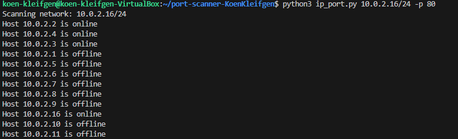

# Network and Port Scanner

This project is a simple network and port scanner written in Python. It can scan a network to find live hosts and check for open ports on those hosts.

## Features

- Scan a network to find live hosts using ICMP ping.
- Scan specified ports on live hosts to check if they are open.

## Requirements

- Python 3.x
- `ipaddress` module (standard library)
- `subprocess` module (standard library)
- `argparse` module (standard library)
- `socket` module (standard library)
- `concurrent.futures` module (standard library)

## Usage

To use the network and port scanner, run the `ip_port.py` script with the required arguments.

### Scan a Network

To scan a network, provide the CIDR notation for the network:

```sh
python ip_port.py 192.168.1.0/24
python ip_port.py 192.168.1.0/24 -p 22 80 443
Scanning network: 192.168.1.0/24
Ex. Host 192.168.1.1 is online
Ex. Host 192.168.1.2 is offline
```




